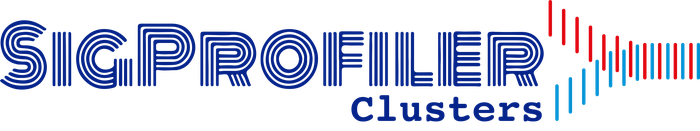

[](https://sigprofilersuite.github.io/SigProfilerClusters/)
[](https://opensource.org/licenses/BSD-2-Clause)
[](https://github.com/SigProfilerSuite/SigProfilerClusters/actions/workflows/ci.yml)



# SigProfilerClusters
SigProfilerClusters analyzes inter-mutational distances (IMD) between SNV-SNV and INDEL-INDEL mutations, separating them into clustered and non-clustered groups on a sample-dependent basis. Clustered SNVs are further subclassified into doublet base substitutions (DBS), multi-base substitutions (MBS), omikli, and kataegis events. The tool uses [SigProfilerSimulator](https://github.com/SigProfilerSuite/SigProfilerSimulator) to build a per-sample background model and applies a regionally corrected IMD threshold to identify mutations unlikely to have co-occurred by chance.

## Documentation
Detailed documentation can be found at https://sigprofilersuite.github.io/SigProfilerClusters.

## Quick Start Guide

### Installation

Install the current stable PyPI version of SigProfilerClusters:
```
$ pip install SigProfilerClusters
```

Install your desired reference genome (available genomes: GRCh37, GRCh38, mm9, mm10):
```python
$ python
from SigProfilerMatrixGenerator import install as genInstall
genInstall.install('GRCh37')
```

### Running

First, generate a background model using [SigProfilerSimulator](https://github.com/SigProfilerSuite/SigProfilerSimulator) (minimum 100 simulations recommended):
```python
from SigProfilerSimulator import SigProfilerSimulator as sigSim
sigSim.SigProfilerSimulator(project, project_path, genome, contexts=["288"], chrom_based=True, simulations=100)
```

Then, partition mutations into clustered and non-clustered sets:
```python
from SigProfilerClusters import SigProfilerClusters as hp
hp.analysis(project, genome, contexts, simContext, input_path)
```

Results are placed under `[project_path]/output/clustered/` and `[project_path]/output/nonClustered/`. Visualizations are found under `[project_path]/output/plots/`.

## Reference

Bergstrom EN, Kundu M, Tbeileh N, Alexandrov LB. Examining clustered somatic mutations with SigProfilerClusters. *Bioinformatics*. 2022;38(13):3470–3473. [https://doi.org/10.1093/bioinformatics/btac335](https://doi.org/10.1093/bioinformatics/btac335)

Bergstrom EN, Luebeck J, Petljak M, et al. Mapping clustered mutations in cancer reveals APOBEC3 mutagenesis of ecDNA. *Nature*. 2022;602:510–517. [https://doi.org/10.1038/s41586-022-04398-6](https://doi.org/10.1038/s41586-022-04398-6)

## Contact

For questions, support requests, or bug reports, please contact the SigProfilerSuite team via GitHub [issues](https://github.com/SigProfilerSuite/SigProfilerClusters/issues) or by email at [contact@sigprofilersuite.org](mailto:contact@sigprofilersuite.org).
